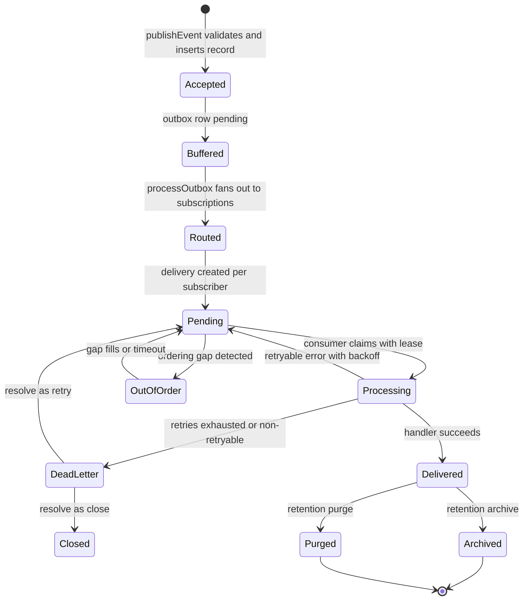

# Event & Messaging Framework — Design

The Event & Messaging Framework is the platform's event-driven backbone. It gives
every module one way to publish, route and consume domain events without wiring
point-to-point integrations. It deliberately reuses existing foundations instead of
re-implementing them: long-running work is scheduled by the Background Job engine,
auditing is delegated to the Audit service, notifications and discovery consume events
as subscribers, and outbound delivery to external partners is handed to the Integration
Hub.

## Goals

- One registry for event types and versioned payload schemas.
- A single publish API with batching, async publishing, correlation and validation.
- A provider-independent bus with topics, queues and consumer groups.
- Subscription management with declarative filters.
- Transactional outbox so events survive transaction rollback and process crashes.
- Ordered, at-least-once delivery with idempotent handlers.
- Retry with backoff, dead-letter capture and controlled replay.
- Retention policies (archive/purge) and full monitoring/traceability.
- Security: tenant scoping, permission checks, classification-aware masking and
  authorization on replay.

## Architecture

```
                    ┌──────────────────────────── UI (React) ───────────────────────────┐
                    │  Event framework: overview · registry · subscriptions · deliveries  │
                    │  dead letters · replay · retention · topics & queues               │
                    └───────────────────────────────┬───────────────────────────────────┘
                                                    │ /api/events, /api/v1/events
                    ┌───────────────────────────────▼───────────────────────────────────┐
                    │ Express router (server/app.js) — auth + can("iam.events.*")        │
                    └───────────────────────────────┬───────────────────────────────────┘
                                                    │
        ┌───────────────┬───────────────┬───────────┼───────────┬───────────────┐
        ▼               ▼               ▼           ▼           ▼               ▼
   Registry        Publisher        Router      Consumer     Replay        Retention
   Schemas         Outbox           Topics      Deliveries   Dead-letter   Monitoring
        │               │               │           │           │               │
        └───────────────┴───────────────┴─────┬─────┴───────────┴───────────────┘
                                              ▼
                          Bus providers · Handlers · Ordering · Idempotency
                                              │
                                              ▼
                     Job engine · Audit · Notifications · Search · Integration
```

### Service layout

Event services mirror the Search, Audit and Integration module conventions: a facade
plus granular files.

| File | Responsibility |
| --- | --- |
| `server/services/events.js` | Facade re-exporting namespaces and the flat `Events` helper |
| `validation.js` | Categories, statuses, retry policy/backoff, JSON-Schema subset, masking, event-type code rules |
| `repository.js` | DTO mappers and query helpers (records, deliveries, attempts) |
| `hooks.js` | Audit, structured logging, error classification and correlation |
| `bus.js` | Provider registry (`database`, `memory`, pluggable), topics/queues/consumer groups |
| `registry.js` | Event types, schema versions, compatibility checks, default catalogue |
| `outbox.js` | Transactional outbox write/claim/process, idempotency keys |
| `subscriptions.js` | Subscribers, filters, activation, validation, test delivery |
| `handlers.js` | Handler registry and built-in bridges (search, notifications, workflow, integration) |
| `ordering.js` | Per-partition sequence numbers and out-of-order buffering |
| `publisher.js` | `publishEvent`, batch/async/correlated publish, validation, serialization, routing |
| `emit.js` | Best-effort domain emitter used by business modules (`emitDomainEvent`, `emitObjectEvent`) |
| `router.js` | Fan-out from records to deliveries/messages; `enqueueMessage` |
| `consumer.js` | Delivery claiming, handler invocation, retry/skip, attempt history |
| `deadletter.js` | Dead-letter capture, inspection and resolution |
| `replay.js` | Replay preview/creation/run/cancel with policy checks |
| `monitoring.js` | Dashboard, throughput, failures, latency, health, ordering, traceability |
| `retention.js` | Retention policies and archive/purge application |
| `jobs.js` | Worker handler registrations and the maintenance sweep |

## Data model

Migration `021_event_messaging_framework` adds the following tables:

- **Registry** — `event_registry`, `event_schemas`.
- **Records** — `event_records`, `event_records_archive`.
- **Reliability** — `event_outbox`, `event_idempotency`, `event_deliveries`,
  `event_delivery_attempts`, `event_dead_letters`.
- **Topology** — `event_topics`, `event_queues`, `event_consumer_groups`,
  `event_subscriptions`.
- **Operations** — `event_replays`, `event_retention_policies`.

All business tables carry `tenant_id` and are scoped through the same tenant filters as
the rest of the platform. Event-type codes are PascalCase domain names; all other codes
are lowercase and unique.

## Event envelope

Every event is stored and delivered as a single canonical envelope. `buildEnvelope` in
`validation.js` normalizes user input, applies event-type defaults and produces the
shape below; the DTO mappers in `repository.js` serialize it for the API.

| Field | Meaning |
| --- | --- |
| `event_ref` | Stable public reference (also the delivery/provenance key) |
| `event_type_code` / `event_version` | Registered type and payload schema version |
| `source_module` | Publishing module (defaults to the type's `source_module`) |
| `source_system` | Logical origin system (default `platform`) |
| `source_object_type` / `source_object_id` / `source_object_revision` | Subject of the event |
| `actor_id` / `actor_type` | Who or what caused it (`USER`, `SYSTEM`, `SERVICE`, `INTEGRATION`) |
| `correlation_id` | Groups all events for one business operation |
| `causation_id` | The event/delivery that directly caused this one |
| `trace_id` | Distributed trace id |
| `parent_event_id` | Parent event when an event is derived |
| `partition_key` | Overrides the default partitioning key for ordering |
| `ordering_scope` | `none`, `global`, `tenant`, `object` or `partition` |
| `priority` | `low`, `normal`, `high` or `critical` |
| `payload` / `payload_schema_version` | Business body validated against the schema |
| `metadata` | Non-business context (never validated, never used for routing decisions alone) |
| `security_classification` | `public`, `internal`, `confidential` or `restricted` |
| `idempotency_key` | Publisher-supplied dedupe key |
| `occurred_at` | Business occurrence timestamp (defaults to publish time) |

Example envelope:

```json
{
  "event_ref": "evt_01HZX8Q2",
  "event_type_code": "ProductReleased",
  "event_version": 2,
  "source_module": "objects",
  "source_system": "platform",
  "source_object_type": "product",
  "source_object_id": "prd_1042",
  "source_object_revision": "B",
  "actor_id": "usr_88",
  "actor_type": "USER",
  "correlation_id": "corr_release_1042",
  "causation_id": null,
  "trace_id": "4f9c1e...",
  "parent_event_id": null,
  "partition_key": "prd_1042",
  "ordering_scope": "object",
  "priority": "normal",
  "payload": { "id": "prd_1042", "revision": "B", "status": "Released" },
  "payload_schema_version": 2,
  "metadata": { "site": "helix-plant-1" },
  "security_classification": "internal",
  "idempotency_key": "release:prd_1042:B",
  "occurred_at": "2026-09-18T07:38:00.000Z"
}
```

The envelope is versioned in the same sense as the payload: `event_version` identifies the
schema generation, so a consumer can branch on it. Additive, backwards-compatible fields
keep the same version; breaking changes require a new version.

## Event lifecycle

An event moves through acceptance, routing, fan-out and delivery. The record itself is
immutable; all state changes happen on outbox, delivery, dead-letter and replay rows.



- **Accepted / Buffered** — `publishEvent` writes `event_records` and, with `useOutbox`,
  an `event_outbox` row in the same transaction. A duplicate `idempotency_key` returns the
  original and never re-enters the pipeline.
- **Routed** — `processOutbox` claims pending outbox rows and `router.js` matches active
  subscriptions, creating one `event_deliveries` row per internal subscriber.
- **Pending / Processing** — consumers claim due deliveries with a visibility lease and
  invoke the registered handler. A crash or lease expiry returns the row to `pending`.
- **Delivered** — recorded with attempt history, duration and handler result.
- **OutOfOrder** — held in `ordering.js` until the missing partition sequence arrives or
  the timeout elapses.
- **DeadLetter / Closed** — exhausted or non-retryable failures land in
  `event_dead_letters`; operators retry or close them.
- **Archived / Purged** — retention moves expired records to `event_records_archive` or
  deletes them.

Replay is a parallel path: `replay.js` re-emits historical records as new deliveries with
a distinct `replay_ref`, without mutating the original record or its state.

## Event registry and schema management

`ensureDefaultEventTypes` seeds the default catalogue across categories `object`,
`product`, `bom`, `document`, `change`, `workflow`, `lifecycle`, `manufacturing`,
`quality`, `project`, `user`, `security`, `integration` and `analytics` — for example
`ProductCreated`, `ProductReleased`, `BOMReleased`, `DocumentReleased`,
`ChangeRequestCreated`, `WorkflowStarted`, `LifecycleStateChanged` and
`ItemStatusChanged`.

Each event type declares `category`, `source_module`, optional `ordering_scope` /
`ordering_required`, `security_classification`, `retention_days` and `replay_policy`.
Schemas are versioned in `event_schemas` (JSON-Schema subset). Publishing a new version
runs `compareSchemas`, which flags breaking changes (`removed_property`, `type_changed`,
`added_required`) as incompatible; `POST /event-types/:code/compatibility` exposes the
same check to operators.

## Schema contract

Payload schemas use a deliberately small JSON-Schema subset so validation stays
provider-independent and dependency-free. Supported keywords:

| Keyword | Behavior |
| --- | --- |
| `type` | `object`, `array`, `string`, `number`, `integer`, `boolean`, `null` (or an array of them) |
| `required` | Property names that must be present and non-null |
| `properties` | Per-property subschema, applied recursively |
| `items` | Subschema for every array element |
| `enum` | Value must deep-equal one of the listed literals |
| `additionalProperties: false` | Rejects unknown properties |

Contracts:

- A type has a stable `event_type_code`; every edit to the payload shape is published as a
  new row in `event_schemas` and bumps `event_version`.
- `publishEvent` validates against the **active** schema for the resolved version before
  writing the record. A failure raises `400` with the offending JSON path and never
  reaches the outbox.
- `POST /event-types/:code/compatibility` compares two versions and returns a verdict
  (`compatible` or the breaking reasons). Run it before activating a subscriber that
  depends on a new version.
- Events with no schema are accepted but treated as opaque payloads; handlers must not
  assume structure.
- Schemas are immutable once published. To fix a bad schema, publish a new version rather
  than editing history.

Well-formed example:

```json
{
  "type": "object",
  "required": ["id", "status"],
  "properties": {
    "id": { "type": "string" },
    "status": { "type": "string", "enum": ["Draft", "Released", "Obsolete"] },
    "tags": { "type": "array", "items": { "type": "string" } }
  },
  "additionalProperties": true
}
```

## Publishing and the transactional outbox

`publishEvent` is the primary integration point. Call it inside your business
transaction and the outbox guarantees delivery:

1. resolve (or auto-register, if enabled) the event type,
2. validate the payload against the active schema,
3. mask classified fields for logging/metadata,
4. insert `event_records` plus an `event_outbox` row (idempotent on `idempotency_key`;
   duplicates return `{ duplicate: true }`),
5. when `useOutbox` is false, route immediately.

`publishBatch`, `publishAsync` and `publishWithCorrelation` support bulk, fire-and-forget
and trace-correlated publishing. `processOutbox` claims pending rows and routes them,
retrying with backoff. The worker runs this on every maintenance sweep.

## Bus, topics, queues and consumer groups

`bus.js` exposes `registerBusProvider`, `resolveBus`, `createTopic`, `createQueue` and
`createConsumerGroup`. `database` and `memory` providers are built in; Kafka, RabbitMQ,
Azure Service Bus and AWS SNS/SQS plug in through `registerBusProvider` without changing
the publisher. `ensureDefaultTopology` installs the default topic, queue and consumer
group.

## Subscriptions and routing

`createSubscription` registers a subscriber with an optional JSON filter over event type,
tenant, organization, site, module, object and payload/metadata. `router.js` fans a
stored record out to every matching active subscription, creating `event_deliveries` for
internal subscribers and `event_messages`-style queue rows where applicable. Filters are
validated up front and can be exercised with `POST /subscriptions/:code/test`.

`ensureDefaultSubscriptions` wires the platform's built-in consumers to the core domain
catalogue so the backbone works out of the box (all active, idempotent, editable from the
console): search reindexes on `LifecycleStateChanged`, workflow bindings are evaluated for
`LifecycleStateChanged` and `ItemStatusChanged`, analytics records lifecycle/workflow
events, and release events (`ProductReleased`, `BOMReleased`, `DocumentReleased`,
`ChangeReleased`) are forwarded to the Integration Hub.

## Domain integration

Business modules publish through `emit.js` rather than calling other modules directly.
Emission uses the transactional outbox and is best-effort (a framework hiccup never fails
the business write), matching the platform's existing change-hook philosophy.

| Module | Events published |
| --- | --- |
| Objects (`objects/objects.js`) | `ObjectCreated`, `ObjectUpdated`, `ObjectDeleted`, `ItemStatusChanged` |
| Relationships (`objects/relationships.js`) | `RelationshipCreated`, `RelationshipUpdated`, `RelationshipDeleted` |
| Lifecycle (`lifecycle/apply.js`) | `LifecycleStateChanged` |
| Workflow (`workflow/engine.js`) | `WorkflowStarted`, `WorkflowCompleted` |

Consumers remain decoupled: `handlers.js` bridges events to Search (`search.index`),
Notifications (`notification.dispatch`), Workflow (`workflow.trigger`), the Integration Hub
(`integration.forward`), Analytics (`analytics.record`) and Audit (`audit.record`). New
modules publish by calling `emitDomainEvent`/`Events.publish`; no changes to the framework
are required.

## Delivery, ordering and idempotency

`consumer.processDeliveries`/`processDelivery` claim due deliveries, resolve the handler
from the handler registry, invoke it and record an `event_delivery_attempts` row.
- **At-least-once**: deliveries are only marked delivered after the handler succeeds.
- **Ordering**: `ordering.js` assigns per-partition sequence numbers for types with
  `ordering_scope`; out-of-order deliveries are buffered until the gap fills or a timeout
  elapses.
- **Idempotency**: handlers can rely on the delivery `idempotency_key`; repeated
  processing is a no-op.
- **Retry**: `normalizeRetryPolicy`/`computeBackoffSeconds` drive exponential backoff;
  non-retryable error categories fail fast.
- **Skip**: `skipDelivery` force-completes a delivery without invoking the handler.

## Creating a handler

A handler is the business action taken for an event. Handlers live in the consuming
module; the framework only routes to them and guarantees at-least-once delivery.

1. **Register** the handler once at module startup with `registerHandler(code, fn, options)`:

```js
import { registerHandler } from "../services/events/handlers.js";

registerHandler(
  "manufacturing.releaseTooling",
  async ({ db, event, payload, delivery, subscription, worker }) => {
    await releaseTooling(db, payload.id, { revision: payload.revision });
    return { released: payload.id };
  },
  { description: "Release tooling for a product", module: "manufacturing" }
);
```

2. **Subscribe** an event type to the handler (console under **Subscriptions**, or
   `createSubscription`). A subscription binds `event_type_code` to a `handler` code and
   an optional JSON filter.

3. **Verify** with `POST /subscriptions/:code/validate` and
   `POST /subscriptions/:code/test`, then activate it.

Handler context:

| Key | Contents |
| --- | --- |
| `db` | Database handle — run all work in the handler's own transaction |
| `event` | Full envelope, with `payload`/`metadata` already parsed |
| `payload` | Parsed payload (same object as `event.payload`) |
| `delivery` | Delivery row: `id`, `event_ref`, `attempts`, `idempotency_key`, `replay_ref` |
| `subscription` | Matched subscription, with `filter` parsed |
| `worker` | Worker identity processing the delivery |

Rules:

- **Be idempotent.** Delivery is at-least-once; a handler can run more than once for the
  same event. Use `delivery.idempotency_key` (or your own natural key) to dedupe.
- **Throw to retry.** Any thrown error is classified by `error.category`; retryable errors
  back off and redeliver, non-retryable ones (`validation`, `configuration`,
  `authorization`) dead-letter immediately. An unknown handler code is a `configuration`
  error and dead-letters at once.
- **Keep it short.** Handlers run under a lease timeout; offload long work to a background
  job rather than blocking the consumer.
- **Stay best-effort for optional targets.** Bridges to Notifications/Workflow must not
  fail the delivery when the optional module is unavailable.
- **Return a small JSON-serializable result.** It is recorded for observability.

## Dead letters, replay and retention

- `deadletter.js` captures deliveries that exhaust retries into `event_dead_letters`;
  operators inspect and `resolveDeadLetter` (requeue as retry, or close).
- `replay.js` previews and creates replay batches. Replay deliveries carry a distinct
  `replay_ref` so uniqueness constraints do not suppress them; they run oldest-first and
  are rate limited. `assertReplayAllowed` blocks event types whose `replay_policy` is
  `denied` (for example `SecurityAccessDenied`).
- `retention.js` manages `event_retention_policies` (per event type, `archive` or
  `purge`). `applyRetention` moves expired records to `event_records_archive` or deletes
  them, and reports counts.
- `event_replays` tracks replay batches and their progress/statistics.

## Monitoring and traceability

`monitoring.dashboardSummary` aggregates registry, topology, delivery, dead-letter and
replay health. `healthCheck` reports bus/provider and queue depth. Dedicated endpoints
expose throughput, failures, latency percentiles, ordering state and end-to-end
traceability by correlation id.

## Job engine integration

Worker handlers (registered in `events/jobs.js`) run the framework:

| Handler | Purpose |
| --- | --- |
| `EVENT_OUTBOX_PUBLISH` | Claim and route pending outbox records |
| `EVENT_CONSUME` | Process due event deliveries |
| `EVENT_REPLAY` | Execute a replay batch |
| `EVENT_RETENTION` | Apply retention policies |
| `EVENT_MAINTENANCE` | Periodic convergence sweep (outbox, deliveries, ordering) |

## Security

- Every route is authenticated and authorized through `iam.events.*` resources.
- Tenant/organization scoping is enforced by `eventTenant`/repository filters.
- Payloads classified `confidential` or `restricted` are masked before logging and
  metadata exposure.
- Replay honors `replay_policy` and permission checks.
- Outbound propagation to external systems is delegated to the Integration Hub, which
  applies its own signing and SSRF guards.
- Every mutation is written to the audit framework under `events.*` actions.

## Permissions

The seed registers `iam.events` and nine child resources (`registry`, `publish`,
`subscriptions`, `topology`, `deliveries`, `deadletters`, `replay`, `retention`,
`monitoring`), each with create/read/update/delete (+ execute where relevant). They are
granted to the `platform` and `iamAdmin` roles by default.

## Frontend

`web/src/pages/EventsPage.jsx` is a tabbed console backed by
`web/src/components/events/EventsPanels.jsx`: overview/monitoring, event registry,
subscriptions, deliveries, dead letters, replay, retention and topics & queues. It reuses
the shared integration UI primitives (`common.jsx`). `web/src/api.js` exposes the
`events` namespace for all framework routes.

## Integration with other modules

- **Objects / Relationships / Lifecycle / Workflow** — publish domain events through
  `emit.js` (transactional outbox); see "Domain integration" above.
- **Audit** — `hooks.js` writes `events.*` audit entries.
- **Notifications / Search / Workflow / Analytics** — built-in handlers bridge events to
  these modules through the handler registry (`handlers.js`), wired by default
  subscriptions.
- **Integration Hub** — `integration.forward` republishes release events to external
  systems.
- **Job engine** — all heavy/scheduled work runs as background jobs, never inline.
