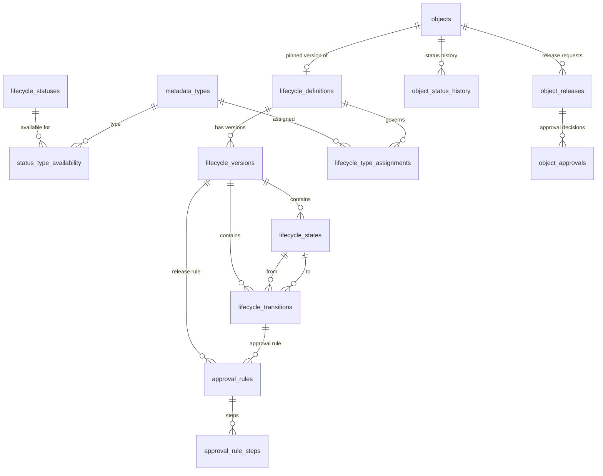
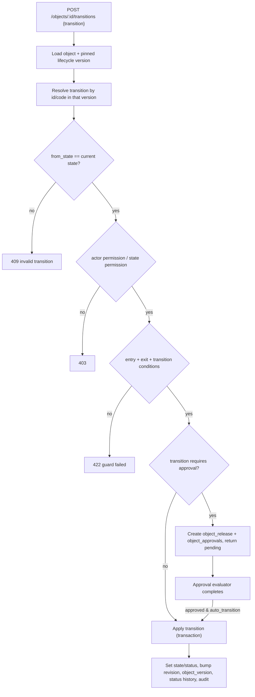

# Helix Platform — Lifecycle Management

A reusable, metadata-driven **lifecycle engine** for the Helix enterprise platform. It
owns status definitions, lifecycle templates and state machines, the state-transition
engine and the release/approval rule evaluator. Future modules (Product Data, Documents,
BOM, Change Management, Quality) consume it instead of hard-coding `draft → released`
logic of their own.

The engine is **configuration-driven**: statuses, lifecycle templates, states, transitions
and approval rules are tenant/global configuration rows. No business object lifecycle is
hard-coded. Objects are the metadata-typed instances from the Object & Relationship
Framework, so lifecycle applies uniformly to parts, documents, BOMs, changes, inspections,
...

## Goals and principles

- **Multi-tenant & scalable** — global (system) configuration plus tenant-local overrides,
  with indexed lookups and per-object pinned versions.
- **Metadata-driven** — statuses/lifecycles are platform metadata scoped exactly like
  `metadata_types` (`tenant_id NULL` = global, shared read-only).
- **API-first & in-process reusable** — REST plus a `platform.js` facade.
- **Configuration-driven** — states, transitions, guards and approvals are data, not code.
- **Secure by default** — every route requires IAM; tenant isolation on every row.
- **Versioned & extensible** — lifecycle templates are versioned; publishing creates an
  immutable version.
- **Transactionally consistent** — transitions, approval decisions and object updates are
  atomic (`transaction(db, fn)`).
- **No hard-coded business-object lifecycle** — object types are *assigned* to a lifecycle.
- **Released objects are never silently affected by configuration changes** — an object
  pins the lifecycle *version* it was created under; editing/publishing a new lifecycle
  version does not move existing objects.

## Inspected groundwork (reused, not duplicated)

| Concern | Existing component reused |
|---------|---------------------------|
| Persistence | `queryAll` / `queryOne` / `run` / `nowIso` / `transaction` / `randomUuid` (`server/db.js`) |
| Validation & errors | `HttpError`, `requireFields`, `validateCode`, `pagination` |
| Metadata engine | `metadata.findType`, `assertValidRecord`, `evaluate` (conditions), `renderType` |
| Scope model | `metadata/scope.js` (`readTenant`, `writeTenant`, `tenantClause`, `assertReadable`, `assertMutable`) |
| Tenancy | `tenants.assertTenantScope`, `homeTenantId`, `isPlatformAdmin` |
| IAM | `requirePermission` middleware, `checkPermission` |
| Audit | `writeAudit` into `audit_logs` |
| Objects | `objects.createObject` / `findObjectRow` / `recordObjectVersion` / `setObjectStatus` and the `objects` table |
| Routing | Express + `wrap(...)` + `can(...)` in `server/app.js` |

No new runtime dependencies are introduced.

## Domain entity model



| Table | Purpose |
|-------|---------|
| `lifecycle_statuses` | Configurable status: code, name, label, category, module, owner, display order, legacy mapping, active state, scope |
| `status_type_availability` | Which object types a status may appear on |
| `lifecycle_definitions` | Logical lifecycle template (code, name, module, current published version, scope) |
| `lifecycle_versions` | Immutable published/draft versions of a template (`snapshot`, `status`, `published_at/by`) |
| `lifecycle_states` | States of a lifecycle version: initial/terminal, editability/visibility, permissions, entry/exit conditions |
| `lifecycle_transitions` | Allowed edges: from-state, to-state, guards, required permission/role, approval gate, auto flag |
| `lifecycle_type_assignments` | Object-type → lifecycle assignment (global or tenant) |
| `approval_rules` | Release/approval rules bound to a version and/or transition (`kind`, quorum, sequencing, mandatory comment, conditions, auto-transition, rollback state) |
| `approval_rule_steps` | Ordered/parallel approval steps with approver resolution (role / user / organization) and quorum |
| `object_releases` | A release/approval request for one object (status, requested_by, resolved_at) |
| `object_approvals` | Per-step decisions (approve/reject/request_changes), approver, comment, timestamp |
| `object_status_history` | Immutable status/state trail per object (from/to state, transition, actor, reason, source) |

`objects` gains three nullable columns: `lifecycle_version_id`, `lifecycle_state_id`,
`lifecycle_status_id`. `objects.status` is retained as a **derived compatibility column**
mapped from the status's `legacy_status` so the existing object API/UI keep working.

## Status model

Statuses are configuration metadata with the same scope rules as metadata:

- **Categories** — `draft`, `in_review`, `approved`, `released`, `obsolete`, `cancelled`.
- **Ownership/module** — `owner` and `module` for catalogue grouping.
- **Object-type availability** — via `status_type_availability`; a status with no
  availability rows is available to every type.
- **Default initial status** — `is_default` marks the tenant default used when a type has
  no lifecycle assignment.
- **Display** — `display_order`, `label`, optional `color`.
- **Scope** — global (`tenant_id NULL`, platform-admin only) or tenant-local.
- **History/audit** — every status change is written to `object_status_history` *and*
  `audit_logs`.

Statuses are never referenced by hard-coded string in business logic; object code resolves
them through the status service and syncs the legacy `objects.status` column via
`legacy_status`.

## Lifecycle templates & versioning

A `lifecycle_definitions` row is the stable identity. A `lifecycle_versions` row is a
snapshot of states + transitions. A definition is created as an (unpublished) draft
version; `publish` validates and flips the version to `published`, archiving the previous
published version.

```
Definition "product-lifecycle"
  v1 published:  Draft → In Review → Approved → Released → Obsolete
  v2 draft:      Draft → In Review → Approved → Released → Cancelled / Obsolete
```

Objects pin `lifecycle_version_id` at assignment time. Publishing v2 does **not** move
objects pinned to v1; an explicit upgrade operation would be required (documented as a
next step).

### Validation

Before a version can be published (and on every state/transition write), the engine
validates:

- exactly one initial state;
- no transitions out of terminal states;
- every transition references states of the same version;
- no duplicate transition codes;
- reachability: every non-initial state is reachable from the initial state;
- **no cycles** in the transition graph (unless explicitly allowed by self-transitions);
- at least one terminal state.

Invalid or circular definitions are rejected with `422` and a structured error list.

## State-transition evaluation flow



The engine is generic: it reads `from`/`to`, guards and gates from configuration and never
inspects the business type. Conditions are metadata expression JSON evaluated against the
object's attribute payload plus `{ status, state, category, organization_id, actor_id }`.

## Release & approval behaviour

`approval_rules` are bound to a lifecycle version (release gate) or a specific transition
(transition gate). A rule declares:

- `required_approvals` / per-step `min_approvals` quorums;
- `sequential` (steps resolve in order) vs parallel steps (`parallel = 1`);
- approver resolution: `role`, `user` or `organization` (+ site/organization scope);
- step `conditions_json` evaluated against the object;
- `mandatory_comment_on_reject`;
- `auto_transition` (move the object when the rule is satisfied);
- `rollback_state_id` (where a rejected object is returned to, when configured).

Workflow:

1. `requestRelease` validates **release eligibility** (object is in the rule's from-state,
   required attributes present, required references satisfied, rule conditions true) and
   creates an `object_releases` row plus `object_approvals` for the applicable steps.
2. `decideApproval` records `approve` / `reject` / `request_changes`. Rejection requires a
   comment when configured. `request_changes` returns the request to the requester, who can
   **resubmit** (which re-opens pending steps).
3. When the quorum and sequencing rules are satisfied the release becomes `approved`; if
   `auto_transition` is set the object moves to the target state atomically.
4. Rejection can trigger the configured rollback (e.g. Released → In Review) and is always
   written to history + audit.

## Workflow integration approach

There is currently no separate workflow engine in the platform. To avoid duplicating
workflow execution and to keep the door open, `server/services/lifecycle/workflow.js`
defines a narrow integration contract (`resolveApprovers`, `startApproval`, `decide`,
`onComplete`). The default executor is the in-process approval engine in `approvals.js`.
If a general Workflow Engine is later introduced, it is registered through the same
contract (`registerWorkflowExecutor`) and lifecycle/approval requests are delegated to it.
Lifecycle never re-implements scheduling, timers or long-running orchestration.

## Object framework integration

- On `createObject`, if the object's type has an active assignment, the object pins the
  currently published `lifecycle_version_id` and starts at the lifecycle's initial state
  (`lifecycle_state_id`/`lifecycle_status_id`); `objects.status` is synced via the status's
  `legacy_status`.
- Lifecycle APIs operate on existing objects: `/objects/:id/lifecycle`,
  `/objects/:id/transitions`, `/objects/:id/release`.
- Transitions bump the object revision, write an `object_versions` snapshot, a
  `object_status_history` row and an audit entry — consistent with the object framework.
- The legacy `POST /objects/:id/status` path still exists; the lifecycle engine is the
  configurable, guarded route.

## Security and tenant isolation

- Configuration routes are gated by IAM resources `iam.lifecycle` plus the sub-resources
  `iam.lifecycle.statuses`, `iam.lifecycle.definitions`, `iam.lifecycle.transitions`,
  `iam.lifecycle.release-rules` and `iam.lifecycle.approvals`.
- Global configuration (`tenant_id NULL`) is readable by all, writable only by platform
  admins; tenant configuration is isolated to its tenant; cross-tenant access returns 404.
- Object lifecycle routes additionally require the object read/update permission.
- Every configuration change, transition, release request, approval decision and status
  change is written to `audit_logs`.

## REST API

| Method | Path | Purpose |
|--------|------|---------|
| GET/POST | `/api/statuses` | List / create statuses |
| GET/PUT/DELETE | `/api/statuses/:id` | Read / update / delete a status |
| POST | `/api/statuses/:id/status` | Activate / deactivate |
| GET/POST | `/api/lifecycle-definitions` | List / create lifecycle definitions |
| GET/PUT/DELETE | `/api/lifecycle-definitions/:id` | Read / update / delete |
| GET | `/api/lifecycle-definitions/:id/versions` | Version history |
| POST | `/api/lifecycle-definitions/:id/publish` | Validate + publish current draft |
| POST | `/api/lifecycle-definitions/:id/validate` | Validate a version without publishing |
| GET/POST | `/api/lifecycle-states` | List / create states (by version) |
| GET/PUT/DELETE | `/api/lifecycle-states/:id` | State config for a state |
| GET/POST | `/api/lifecycle-transitions` | List / create transitions |
| GET/PUT/DELETE | `/api/lifecycle-transitions/:id` | Transition config |
| GET/POST | `/api/lifecycle-assignments` | Object-type → lifecycle assignment |
| DELETE | `/api/lifecycle-assignments/:id` | Remove an assignment |
| GET/POST | `/api/release-rules` | Release rules (`kind=release`) |
| GET/POST | `/api/approval-rules` | Approval rules (`kind=approval`) |
| GET/PUT/DELETE | `/api/approval-rules/:id` | Rule detail |
| GET | `/api/objects/:id/lifecycle` | Current lifecycle state, status, available transitions |
| POST | `/api/objects/:id/transitions` | Execute a transition (guarded, may gate on approval) |
| GET | `/api/objects/:id/transitions` | Transition/status history |
| POST | `/api/objects/:id/release` | Request release (approval workflow) |
| GET | `/api/objects/:id/release` | Release + approval status |
| POST | `/api/objects/:id/approvals/:approvalId` | Approve / reject / request changes / resubmit |
| GET | `/api/objects/:id/status-history` | Status history |

All list endpoints support `page`, `pageSize`, `q` and entity filters.

## Implementation plan (delivered)

1. Migration `010_lifecycle` in `server/schema.sql` + `server/db.js` marker and object
   columns.
2. `server/services/lifecycle/statuses.js` — status configuration service.
3. `server/services/lifecycle/definitions.js` — templates, versions, states, transitions,
   validation and assignments.
4. `server/services/lifecycle/engine.js` — state-transition engine and object integration.
5. `server/services/lifecycle/approvals.js` — release/approval rule evaluator.
6. `server/services/lifecycle/workflow.js` — workflow integration contract.
7. `server/services/lifecycle.js` facade + `platform.js` re-exports.
8. IAM resources/grants and `seedLifecycle` demo data.
9. REST routes in `server/app.js`.
10. Unit + HTTP integration tests, design/API docs, README and admin UI.

## Known limitations / next steps

- Objects pin a lifecycle version but there is no bulk "upgrade to a new version" wizard;
  migrating in-flight objects is an explicit future operation.
- Approval routing is deterministic (role/user/organization); absence of an eligible
  approver is surfaced as `pending` rather than auto-escalated. Delegation/escalation and
  SLA timers belong to a future Workflow Engine.
- Conditions reuse the metadata expression evaluator, so they operate on the object's own
  attributes/status; cross-object conditions are not yet supported.
- Org/site-scoped approver rows are stored and honoured on request, but site-level routing
  rules are minimal.
