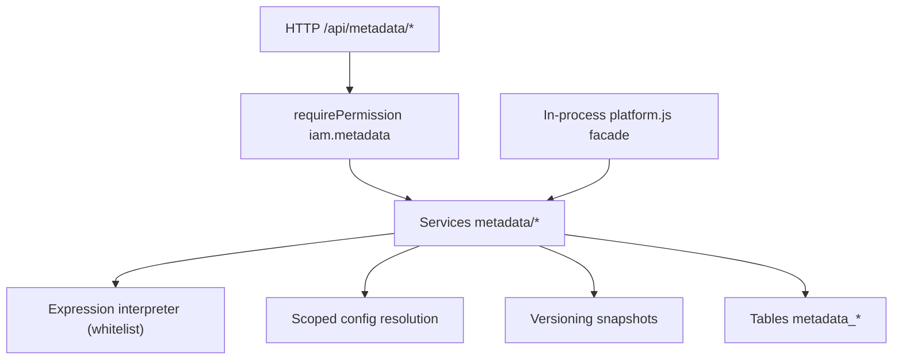
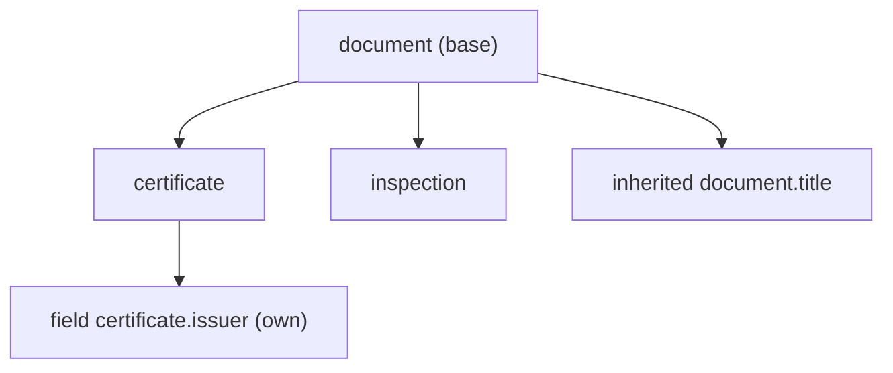
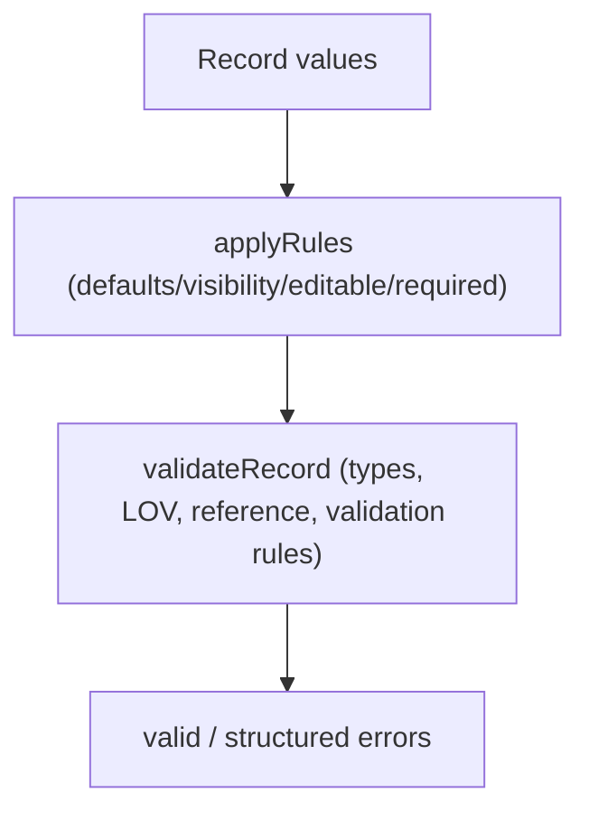

# Helix IAM — Configuration & Metadata Management

A reusable, multi-tenant metadata layer for design and manufacturing modules. Modules declare **types**, **attributes**, **lists of values (LOVs)**, **dynamic forms**, **rules**, and **scoped configuration** through APIs instead of hard-coding business assumptions in code.

## Goals

- Configuration-driven: new record shapes are data, not migrations.
- Reusable: one engine serves every current and future module (parts, quality, inspections, documents, work orders, ...).
- API-first and UI-agnostic: the server returns a render tree that React, mobile clients, or previews all consume.
- Multi-tenant and secure by default: global artifacts are shared read-only; tenant artifacts are isolated; all writes are permission-checked and audited.
- Versioned and extensible: every change to a type, attribute, LOV, form, or rule is snapshotted.
- Safe: rules run through a whitelisted expression interpreter. No `eval`, no `Function`, no arbitrary code.

## Architecture

Metadata is a service module under `server/services/metadata/` following the same idioms as the rest of Helix: Express routes, `node:sqlite` persistence, `requirePermission`, `writeAudit`, and tenant/config helpers. It reuses the existing tenant scope and configuration model and adds no runtime dependencies.



Consumers either call REST or import the facade:

```javascript
import { resolveType, validateRecord, renderForm } from "./server/platform.js";
```

## Entity model

| Table | Purpose |
|-------|---------|
| `metadata_types` | Record shapes; optional single parent for inheritance |
| `metadata_attributes` | Field definitions (data type, validation, LOV, reference) |
| `metadata_type_attributes` | Type-to-attribute membership; `removed=1` masks an inherited attribute |
| `metadata_lovs` / `metadata_lov_values` | Lists of values; self-referencing `parent_value_id` for cascading |
| `metadata_lov_usage` | Usage locks so an in-use value is retired, not deleted |
| `metadata_forms` / `metadata_form_nodes` / `metadata_form_fields` | Dynamic forms: layout tree plus ordered fields |
| `metadata_rules` | Condition + action rules by category |
| `metadata_versions` | Immutable snapshots for type, attribute, lov, form, rule |
| `metadata_configurations` | Per-scope enable/disable and pinned version |

Data types: `string`, `integer`, `decimal`, `boolean`, `date`, `datetime`, `reference`, `multi_value`. Form node kinds: `tab`, `section`, `group`. Form modes: `create`, `edit`, `view`. Rule categories: `validation`, `visibility`, `editability`, `default`, `dependency`, `condition`. Artifact types for versioning/config: `type`, `attribute`, `lov`, `form`, `rule`.

## Global vs tenant scope

Every artifact carries `tenant_id`:

- `tenant_id NULL` → global/system artifact. Readable by every tenant; mutable only by a platform administrator.
- `tenant_id = N` → readable and mutable only inside tenant `N`. Cross-tenant access returns **404** (existence is not leaked).

Reads combine global + caller tenant (`tenantClause`), so a tenant always sees the shared library plus its own extensions. Writes resolve the target tenant through `writeTenant`, which requires platform rights to touch global rows.

## Attribute design

Attributes are declared once and attached to types. An attribute defines:

- `data_type` and display flags (`visible`, `editable`, `required`, `multi_value`)
- `default_value`, `min_length`, `max_length`, `min_value`, `max_value`
- `validation` JSON: `pattern` (regex, length-capped), `message`, `min_items`, `max_items`, `integer`, `scale`, `reference_type`
- `lov_id` to bind a list of values
- `parent_attribute_id` for composite/derived attributes

The validation engine (`validateRecord`) coerces values, applies defaults and rule actions, enforces type/range/pattern/LOV/reference checks, and reports structured errors. Unknown fields are preserved rather than dropped, so metadata changes never silently destroy existing data.

## Inheritance

Types form a single-parent tree. Resolving a type walks ancestors and merges attributes:

1. Own attributes, then inherited ancestors (nearest ancestor wins on conflict).
2. A child may attach an override to adjust required/default/validation.
3. A child may **detach** an inherited attribute; this writes `removed=1` (mask) instead of deleting the ancestor's definition.
4. Cycles and self-parenting are rejected on write.

`effectiveAttributes(db, typeId, tenantId)` returns the flattened set; `resolveType` returns the type plus its attributes. `attributeContract` exposes the same set as a stable field contract for other services.



## LOV design

Lists of values support `single` and `multi` selection. Values are ordered, can be `active`/retired, and can point at a parent value to form cascades (`cascadeOptions(db, lovId, parentValueId)`).

When a value is consumed, modules call `markUsage`. `removeValue` deletes an unused value but **retires** a used one (`active=0`) so historical records stay valid. Deleting a LOV that is still referenced returns **409**. Attribute LOV membership is enforced during validation.

## Form architecture

Forms are declarative: ordered `metadata_form_nodes` (tabs/sections/groups) contain `metadata_form_fields`. `replaceLayout` validates atomically that every field maps to an attribute on the form's type and that conditions are well-formed, then rewrites nodes and fields.

`renderForm` produces a transport-friendly, UI-agnostic tree:

- Fields carry label, data type, required, default, options, validation, `visible`, `editable`.
- Node visibility and field editability are evaluated against supplied `values`/`context`, so clients never interpret rule data.
- View mode forces every field to non-editable.

The reusable React component `web/src/components/FormRenderer.jsx` consumes this tree directly, rendering the correct control per data type and honoring visibility/editability from the server.

## Rules flow

Rules tie a condition (a JSON expression) to one or more actions, scoped to a type or form:

| Phase | Behaviour |
|-------|-----------|
| Validation | `validation` rules contribute `error`/`warn` findings via `validateRecord` |
| Presentation | `default`, `visibility`, `editability`, `dependency` rules mutate working values and flags in `applyRules` |
| Rendering | The renderer folds editability conditions into `editable`; the client simply renders |

Supported actions: `set_visible`, `set_editable`, `set_required`, `set_default`, `set_value`, `clear_value`, `require`, `forbid`, `error`, `warn`. Rules are ordered by priority then deterministic code.

Expressions are interpreted by `expression.js`, a whitelist evaluator:

- Ops: `eq`, `ne`, `gt`, `gte`, `lt`, `lte`, `in`, `not_in`, `contains`, `not_contains`, `starts_with`, `ends_with`, `and`, `or`, `not`, `value`, `literal`, `is_empty`, `is_not_empty`, `matches`, `not_matches`, `len`.
- Guards: `MAX_DEPTH=32`, `MAX_NODES=2000`, `MAX_REGEX_LENGTH=200`.
- Unknown operators are rejected on write; prototype paths (`__proto__`, `constructor.constructor`) resolve to `undefined`.



## Configuration precedence

Artifact enable/disable and pinned versions resolve System → Tenant → Organization, where the lower scope wins for both `enabled` and `pinned_version`:

1. Organization override for the artifact
2. Else tenant override
3. Else system override
4. Else default (`enabled = true`)

`resolveArtifactConfig` returns the effective state plus a `layers` breakdown. `assertEnabled` throws **409** when a disabled artifact is consumed. `effectiveCatalog` powers the admin UI by showing every artifact's effective state and source layer.

## REST APIs

All routes require a session and `iam.metadata` permission (`.types`, `.attributes`, `.lovs`, `.forms`, `.rules` for narrower grants).

| Method | Path | Purpose |
|--------|------|---------|
| GET/POST | `/api/metadata/types` | List / create types |
| GET | `/api/metadata/types/tree` | Inheritance tree |
| GET | `/api/metadata/types/:id` | Type detail |
| PUT/DELETE | `/api/metadata/types/:id` | Update / delete |
| POST | `/api/metadata/types/:id/status` | draft / active / inactive |
| GET | `/api/metadata/types/:id/resolve` | Type with effective attributes |
| GET | `/api/metadata/types/:id/contract` | Flat field contract |
| POST/PUT/DELETE | `/api/metadata/types/:id/attributes[/:attributeId]` | Attach / update / detach |
| GET/POST | `/api/metadata/attributes` | List / create attributes |
| PUT/DELETE | `/api/metadata/attributes/:id` | Update / delete |
| POST | `/api/metadata/attributes/:id/status` | Status |
| GET/POST | `/api/metadata/lovs` | List / create LOVs |
| PUT/DELETE | `/api/metadata/lovs/:id` | Update / delete |
| POST | `/api/metadata/lovs/:id/status` | Status |
| GET/POST | `/api/metadata/lovs/:id/values` | List / add values |
| PUT/DELETE | `/api/metadata/lovs/:id/values/:valueId` | Update / remove (retire if in use) |
| GET | `/api/metadata/lovs/:id/cascade` | Cascading options |
| GET/POST | `/api/metadata/forms` | List / create forms |
| PUT/DELETE | `/api/metadata/forms/:id` | Update / delete |
| POST | `/api/metadata/forms/:id/status` | Activate requires fields |
| PUT | `/api/metadata/forms/:id/layout` | Atomic layout replace |
| GET | `/api/metadata/forms/:id/versions` | Version history |
| GET/POST | `/api/metadata/forms/:id/render` | Render tree |
| GET/POST | `/api/metadata/rules` | List / create rules |
| PUT/DELETE | `/api/metadata/rules/:id` | Update / delete |
| POST | `/api/metadata/rules/:id/status` | Status |
| POST | `/api/metadata/rules/:id/test` | Evaluate a stored rule |
| POST | `/api/metadata/validate` | Validate a record |
| GET/POST | `/api/metadata/configurations` | List / set scoped config |
| GET | `/api/metadata/configurations/effective` | Effective catalog |

## Files

```text
server/services/metadata/
  expression.js     safe whitelist interpreter
  scope.js          global/tenant read + write guards
  versions.js       artifact snapshots
  attributes.js     attribute CRUD + validation
  types.js          type CRUD + inheritance
  lovs.js           LOV values + cascading + usage
  forms.js          form CRUD + layout
  renderer.js       UI-agnostic render tree
  rules.js          rules engine + actions
  validation.js     record validation
  configurations.js scoped artifact config
server/services/metadata.js   public facade
server/tests/metadata.test.js       service tests
server/tests/metadata-api.test.js   HTTP tests
web/src/components/FormRenderer.jsx reusable renderer
web/src/pages/MetadataPage.jsx      admin console
```

## Seed

`seedMetadata` loads a working demo shared with every tenant: LOVs (`part-category`, `lifecycle-status`, `document-class`), twelve attributes, types `part` (base), `quality-record`, and `inspection` (inheritance), forms `part.create` and `part.view`, and four rules covering validation, dependency, and editability.

## Tests

```bash
npm test
```

The suite covers types and inheritance (including cycle rejection), attributes and validation, LOV cascading and usage locks, form layout and rendering, the rules engine and interpreter safety, versioning, configuration precedence, and API-level permission, isolation, and end-to-end flows.

## Limitations and next steps

- Attribute `reference_type` currently checks existence for `organization`, `user`, and `tenant`; other targets can be added as modules register them.
- Inherited-attribute override currently supports attach/detach masks and per-field overrides; richer per-attribute validation overrides are a future extension.
- Rule actions are declarative; computed/derived attributes are represented via `parent_attribute_id` but not yet evaluated server-side.
- Form layout is field-list based; drag-and-drop ordering and node re-parenting are UI follow-ups.
- Caching of resolved types/forms is not implemented; resolution is fast enough at SQLite scale and can be cached per tenant when load grows.
- Configuration supports `enabled` and `pinned_version`; arbitrary per-artifact settings are stored but not yet surfaced in the renderer.
