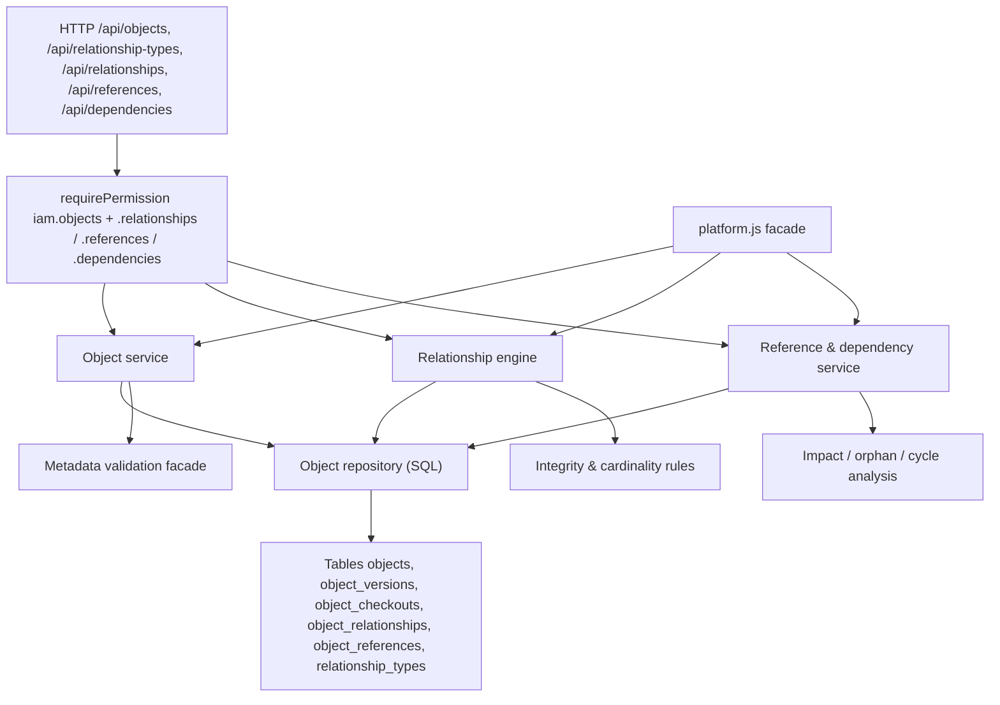
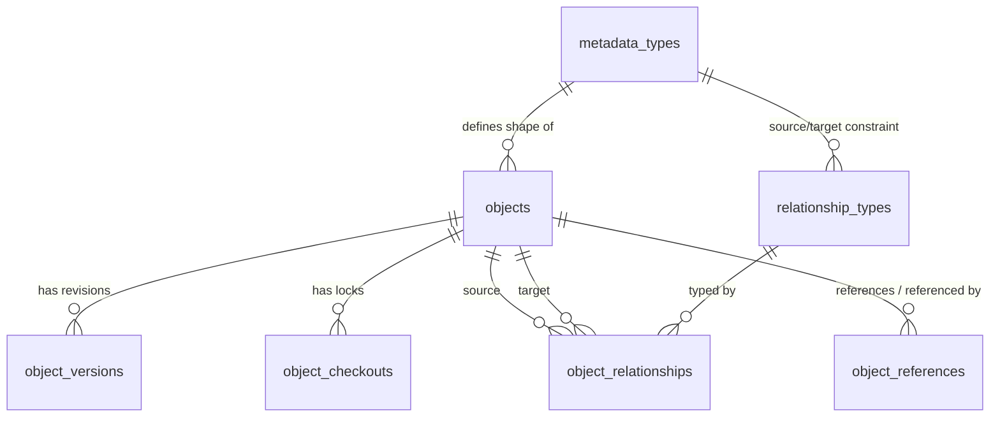

# Helix Platform — Object & Relationship Framework

A reusable platform service for defining, storing, retrieving and managing **business
objects** and the **relationships, references and dependencies** between them. Product
Data, BOM, Documents, Change Management, Quality and every future module consume this
framework instead of inventing their own object store or link table.

The framework is **metadata-driven**: an object's shape is a `metadata_types` definition
from the Configuration & Metadata module, so no business object type is hard-coded here.

## Goals

- Generic: one engine for parts, documents, revisions, BOMs, change notices, inspections, ...
- Metadata-driven: object types and attribute contracts come from `metadata_types`.
- Relationship-driven: typed, cardinality-aware edges with attributes and integrity.
- Reference-aware: strong, weak and external references plus dependency/impact analysis.
- Multi-tenant and secure by default: tenant isolation on every row, IAM on every route.
- Transactional: multi-row writes (object + version, bulk, cascade) are atomic.
- API-first and in-process reusable: REST plus a `platform.js` facade.
- Graph/AI ready: a stable node/edge export for graph stores and embeddings.

## Inspected groundwork (reused, not duplicated)

| Concern | Existing component reused |
|---------|---------------------------|
| Persistence | `node:sqlite`, `queryAll` / `queryOne` / `run` / `nowIso` in `server/db.js` |
| Validation + errors | `HttpError`, `requireFields`, `validateCode`, `pagination` |
| Authorization | `requirePermission`, `checkPermission`, `resources`/`permissions` catalog |
| Tenancy | `tenants.js` (`assertTenantScope`, `homeTenantId`, `isPlatformAdmin`) |
| Object shapes | `metadata.js` (`resolveType`, `assertValidRecord`, `attributeContract`, `assertEnabled`) |
| Audit | `writeAudit` into `audit_logs` |
| Routing | Express + `wrap(...)` + `can(...)` idiom in `server/app.js` |
| Scope model | global (`tenant_id NULL`) vs tenant, mirroring `metadata/scope.js` |

No new runtime dependencies are introduced.

## Architecture



Modules either call REST or import the facade:

```javascript
import { createObject, createRelationship, impactOf } from "./server/platform.js";
```

## Entity model



| Table | Purpose |
|-------|---------|
| `objects` | Business object instance: type, name, owner, org, tenant, lifecycle status, revision, attribute payload, soft-delete |
| `object_versions` | Immutable snapshot per revision (`change_type`, `change_summary`, `snapshot`) |
| `object_checkouts` | Check-out / lock records (`exclusive` / `shared`, expiry, release) |
| `relationship_types` | Edge definitions: source/target type, cardinality, directed/bidirectional, inverse, semantic, occurrence bounds, inline edge attributes |
| `object_relationships` | Edge instances with status, validity window and attribute payload |
| `object_references` | Strong / weak / external references, with a `dependency` flag |

Object lifecycle statuses are generic and business-neutral: `draft`, `active`, `released`,
`obsolete`, `archived`. Soft deletion is orthogonal (`deleted_at`), so records are never
physically removed while references exist.

### Attribute payload

`objects.data_json` stores the metadata-validated attribute values for the object's type.
On create/update the service calls the metadata validation facade:

```javascript
metadata.assertValidRecord(db, { typeId, values, user, organization }, tenantId);
```

so defaults, LOVs, patterns, ranges, required rules and conditional rules all apply, and
unknown fields are rejected exactly as the metadata module dictates. Object-level columns
(`name`, `description`, `owner`, `organization`) stay first-class for indexing and IAM.

## Relationship model

A **relationship type** declares:

- `source_type_id` / `target_type_id` (nullable = any type; inheritance-aware)
- `cardinality`: `1:1`, `1:N`, `N:1`, `N:N`
- `directed` / `bidirectional` and an optional `inverse_code` for the reverse label
- `semantic`: `association` (related to), `aggregation` (part of, weak ownership),
  `composition` (owned by, strong ownership)
- `required`, `min_occurrences`, `max_occurrences` per source
- `allow_self`, `cascade_delete`
- `attributes_json`: inline, metadata-compatible attribute definitions for the edge

The three semantics map directly to the required ownership distinction:

| Concept | Mechanism |
|---------|-----------|
| **Owned by** | `composition` / `aggregation` relationship (cascade soft-delete on composition) |
| **Related to** | `association` relationship |
| **Referenced by** | `object_references` row (strong/weak/external) |

### Cardinality enforcement

| Cardinality | Rule enforced on create |
|-------------|--------------------------|
| `1:1` | target may have at most one source of this type and source at most one target |
| `1:N` | one source → many targets; each target at most one source |
| `N:1` | many sources → one target; each source at most one target |
| `N:N` | unbounded, subject to `max_occurrences` |

`min_occurrences` is checked by `safeDeleteReport` so a required edge cannot
be silently dropped.

### Traversal

`traverse(db, objectId, { direction, type, depth }, tenantId)` performs a breadth-first
walk with a visited set and a hard depth cap (default 5, max 10) using indexed adjacency
lookups (`idx_rel_source`, `idx_rel_target`). `graph(db, objectId, tenantId, { depth })`
returns a `{ root_id, nodes, edges, node_count, edge_count }` projection ready for a graph
store or visualization.

## Reference, dependency and impact behaviour

`object_references` distinguishes:

- **strong** — target object required; deleting the target is blocked until the reference
  is removed (`safeDeleteReport` returns a 409 with offenders).
- **weak** — optional link; if the target is deleted the reference becomes an **orphan**
  surfaced by `orphanReferences`.
- **external** — points outside Helix via `external_system` + `external_ref`; no local
  target, so integrity is advisory only.
- A `dependency = 1` reference (or `composition` relationship) forms a directed dependency
  edge used by impact analysis.

Derived operations:

- `impactOf(objectId)` — transitive downstream set (what depends on this object) and the
  upstream set (what this object depends on), with the path used to reach each node.
- `orphanReferences()` — weak/external references whose target is missing or soft-deleted.
- `detectCycles()` — depth-first cycle detection over dependency edges (composition and
  dependency references), returned as node cycles instead of infinite traversal.
- `safeDeleteReport(objectId)` — strong references, dependent edges, composition children
  and required relationship bounds that block deletion.

Cross-tenant integrity is absolute: source and target objects must resolve to the same
tenant, otherwise the write is rejected with **404** (existence is not leaked).

## Transactional integrity

`transaction(db, fn)` in `server/db.js` wraps multiple statements in `BEGIN`/`COMMIT` and
rolls back on error. Object creation (object + initial version), bulk operations, cascade
deletion and relationship creation run inside it. Nested calls reuse the outer transaction.

## Security and tenant isolation

- Every route requires a session and an IAM permission on `iam.objects`, or the
  object-level sub-resources `iam.objects.relationships`, `iam.objects.references` and
  `iam.objects.dependencies`, applied through `requirePermission(db, resource, action)`
  (`read` / `create` / `update` / `delete`).
- Object ownership is stored on `owner_id` and scoped by `organization_id`; the
  organization in the request body/query is passed as the authorization context so
  org-scoped grants are honoured. Tenant and platform admins retain cross-tenant access.
- `tenant_id` is mandatory on objects, relationships and references. Reads filter by the
  caller's tenant; cross-tenant access returns 404.
- Platform administrators may act in any tenant; ordinary users only in their home tenant.
- Every mutation is written to `audit_logs` and every revision to `object_versions`.

## REST API

| Method | Path | Purpose |
|--------|------|---------|
| GET | `/api/object-types` | Metadata types usable as objects, with counts |
| GET | `/api/objects/summary` | Totals by status and type |
| GET/POST | `/api/objects` | List/search (paging, filter, sort) / create |
| POST | `/api/objects/bulk` | Bulk create |
| PATCH | `/api/objects/bulk` | Bulk update / status / delete / restore |
| GET/PUT/DELETE | `/api/objects/:id` | Read / update / soft delete (`?force=true`) |
| POST | `/api/objects/:id/restore` | Restore a soft-deleted object |
| POST | `/api/objects/:id/status` | Change lifecycle status |
| POST | `/api/objects/:id/checkout` | Check out / lock |
| POST | `/api/objects/:id/checkin` | Release lock |
| GET | `/api/objects/:id/locks` | Active locks for the object |
| GET | `/api/objects/:id/versions` | Revision history |
| GET | `/api/objects/:id/versions/:revision` | A single revision snapshot |
| GET | `/api/objects/:id/relationships` | Incoming + outgoing edges |
| GET | `/api/objects/:id/tree` | Relationship traversal |
| GET | `/api/objects/:id/graph` | Node/edge graph projection |
| GET | `/api/objects/:id/dependencies` | Direct dependencies for the object |
| GET | `/api/objects/:id/safe-delete` | Deletion impact report |
| GET/POST | `/api/relationship-types` | List / create edge definitions |
| GET/PUT/DELETE | `/api/relationship-types/:id` | Read / update / delete |
| POST | `/api/relationship-types/:id/status` | Activate / deactivate a type |
| GET/POST | `/api/relationships` | List / create edges |
| POST | `/api/relationships/validate` | Validate a planned edge without writing |
| GET/PUT/DELETE | `/api/relationships/:id` | Read / update / delete |
| POST | `/api/relationships/:id/validate` | Re-validate a stored edge |
| GET/POST | `/api/references` | List / create references |
| GET/PUT/DELETE | `/api/references/:id` | Read / update / delete |
| GET | `/api/references/orphans` | Weak/external references with missing targets |
| GET | `/api/dependencies/:objectId` | Direct dependency edges |
| GET | `/api/dependencies/impact` | Impact analysis (`?objectId=` downstream + upstream) |
| GET | `/api/dependencies/cycles` | Circular dependency detection |

All list endpoints support `page`, `pageSize`, `q`, and entity-specific filters plus a
`sort` field with an allow-list.

## Implementation plan (delivered)

1. Schema migration `009_objects` with the six tables and supporting indexes.
2. `server/services/objects/repository.js` — SQL persistence and filtering.
3. `server/services/objects/objects.js` — object domain service.
4. `server/services/objects/relationship-types.js` and `relationships.js` — edge engine.
5. `server/services/objects/references.js` — reference/dependency/impact service.
6. `server/services/objects/validation.js` — attribute-contract and edge validation.
7. `server/services/objects.js` facade + `platform.js` re-exports.
8. IAM resources, grants and seed/demo data.
9. REST routes in `server/app.js`.
10. Unit + HTTP integration tests, API docs and README.

## Known limitations / next steps

- Relationship attribute contracts are inline JSON; promoting them to full
  `metadata_attributes` with LOV/reference support is a natural follow-up.
- Traversal is SQL breadth-first with a depth cap; extremely deep or dense graphs would
  benefit from a materialized closure table or an external graph store.
- Impact analysis is computed on demand; caching/lazy invalidation can be added when the
  graph grows.
- Versioning stores full snapshots; a delta format can reduce storage at scale.
