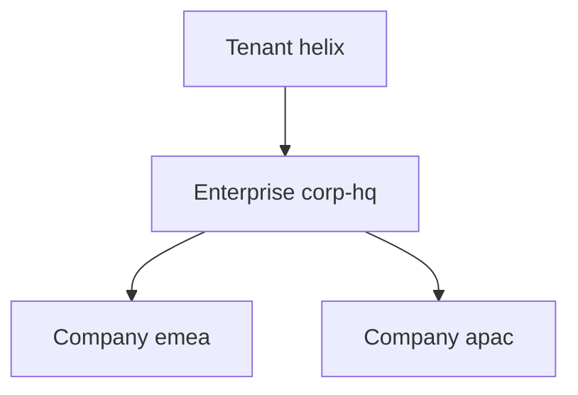

# Helix IAM — Organization & Administration

Multi-tenant administration on top of the existing organization tree. Identity, RBAC, Authentication, and future modules consume tenant + org context through APIs. They do not join directory tables.

## Goals

- Isolate business data by tenant (fail-safe: no match → no access)
- Keep one `organizations` tree; do not duplicate hierarchy
- Preserve manufacturing levels including **Plant** (distinct from Site)
- Super Admin (`iam.platform`) administers tenants; tenant business data requires an explicit tenant context
- Configuration precedence: **Organization > Tenant > System**

## Hierarchy

Default Super Admin definition (still editable under Platform properties):

```
Tenant → Enterprise → Company → Business Unit → Plant → Site → Department
```

Requested operating path inside a tenant is Company → Business Unit → Plant → Site → Department. **Plant stays.** Enterprise remains so existing `corp-hq` is preserved as a node under the tenant.

| Kind | Typical parent | Root | Isolation |
|------|----------------|------|-----------|
| `tenant` | none | yes | Boundary. `tenant_id` = self |
| `enterprise` | tenant | no | Belongs to parent tenant |
| `company` | enterprise or tenant | no | Same tenant |
| `business_unit` | company | no | Same tenant |
| `plant` | business unit | no | Same tenant |
| `site` | plant | no | Same tenant |
| `department` | site | no | Same tenant |
| `organization` | legacy | yes | Same tenant when attached |

A tenant is both:

1. A hierarchy **level** (`kind = tenant`) — same create/move rules as every other node
2. A data **isolation boundary** — `organizations.tenant_id`, `users.tenant_id`, `groups.tenant_id`, `sessions.tenant_id`

Cross-tenant parent pointers and moves are rejected. Sibling sites still cannot become ancestors of each other (existing cycle + parent-kind rules).



## Isolation

Every session carries a tenant context (`sessions.tenant_id`), set at login from the user's home organization and changeable only through an audited switch.

| Caller | Tenant context | Business data (users, orgs, groups, members) |
|--------|----------------|-----------------------------------------------|
| Workforce user | Home tenant (implicit) | That tenant only |
| Tenant operator | Home tenant | That tenant only |
| Super Admin (`iam.platform` / `iam.tenants`) | Must be selected (login home or `POST /api/tenants/:id/select` or `X-Tenant-Id`) | Selected tenant only — never all tenants in one list |
| Unauthenticated | none | Deny |

Rules:

- Get-by-id in another tenant → **404** (do not leak existence)
- Move / member assign / user home org across tenants → **409**
- Super Admin tenant catalog (`/api/tenants`) is administration, not business data
- `X-Tenant-Id` (or `tenantId` query) from Super Admin overrides session tenant and writes `tenant.context.switch` audit
- Non-platform callers may not override tenant context
- `checkPermission` stays grant-based; isolation is enforced on directory reads/writes before authz of the row

## Super Admin vs tenant business data

`iam.platform` may:

- Create, update, activate, deactivate tenants
- Read tenant administration records
- Switch tenant context (audited)
- Edit system-scope configuration and hierarchy **definition**

`iam.platform` may **not**:

- List users, groups, or organization trees across all tenants in one response
- Read another tenant's business row without a selected tenant context

## Configuration: System → Tenant → Organization

| Scope | Stored in | Who writes | `scope_id` |
|-------|-----------|------------|------------|
| System | `platform_settings` | Super Admin (`iam.platform`) | n/a |
| Tenant | `config_values` | Super Admin or tenant admin (`iam.config`) | tenant org id |
| Organization | `config_values` | Org admin (`iam.config` / `iam.organizations`) | organization id |

**Effective value** for key K at org O in tenant T:

1. Organization override for `(K, O)` if present
2. Else tenant override for `(K, T)` if present
3. Else system default (`platform_settings` or definition default)

Missing/invalid override is ignored and the next layer is used (fail-safe fallback). Unknown keys are rejected on write. Types: `boolean`, `number`, `string`, `json` with per-key min/max.

Keys are not hard-coded to a tenant. The catalog (`config_definitions`) lists allowed scopes per key. Authentication, session, and directory flags from Super Admin properties are overridable at tenant/org unless marked system-only.

In-process: `resolveConfig(db, key, { tenantId, organizationId })`. HTTP: `/api/config`.

## REST

Guarded by fail-safe `requirePermission`. Tenant CRUD uses `iam.tenants`. Config uses `iam.config`. Directory stays `iam.organizations`.

| Method | Path | Purpose |
|--------|------|---------|
| GET | `/api/tenants` | List tenants (admin) |
| POST | `/api/tenants` | Create tenant (root org node) |
| GET | `/api/tenants/:id` | Tenant detail + counts |
| PUT | `/api/tenants/:id` | Update tenant |
| POST | `/api/tenants/:id/activate` | Activate |
| POST | `/api/tenants/:id/deactivate` | Deactivate |
| DELETE | `/api/tenants/:id` | Delete with same guards as orgs |
| POST | `/api/tenants/:id/select` | Switch session tenant (audited) |
| GET | `/api/tenants/:id/context` | Consume-side tenant snapshot |
| GET/PUT | `/api/config` | Effective + scoped values |
| GET/PUT | `/api/tenants/:id/config` | Tenant scope |
| GET/PUT | `/api/organizations/:id/config` | Organization scope |

Existing `/api/organizations`, typed collections, `/tree`, `/context`, `/move`, members, and `/api/auth/login` are unchanged in contract; they are **filtered** to the session tenant.

`GET /api/auth/me` includes `tenant` and `tenants` (switch targets).

## Seed

Tenant `helix` (Helix) is created first. Existing codes stay:

```
helix (tenant)
  corp-hq (enterprise)
    emea / apac (company)
      … plants, sites, departments …
```

`corp-hq`, `emea`, `apac`, `emea-london`, `apac-singapore` are preserved. Users still may belong to multiple sites **inside the same tenant**.

## Consume APIs (modules)

In-process (`server/platform.js`):

- `organizationContext(db, id)` — now includes `tenant`
- `resolveTenant(db, actorOrOrg)`
- `resolveConfig(db, key, context)`
- `assertTenantScope(db, actor, tenantId)`

HTTP: `GET /api/tenants/:id/context`, `GET /api/organizations/:id/context`.
