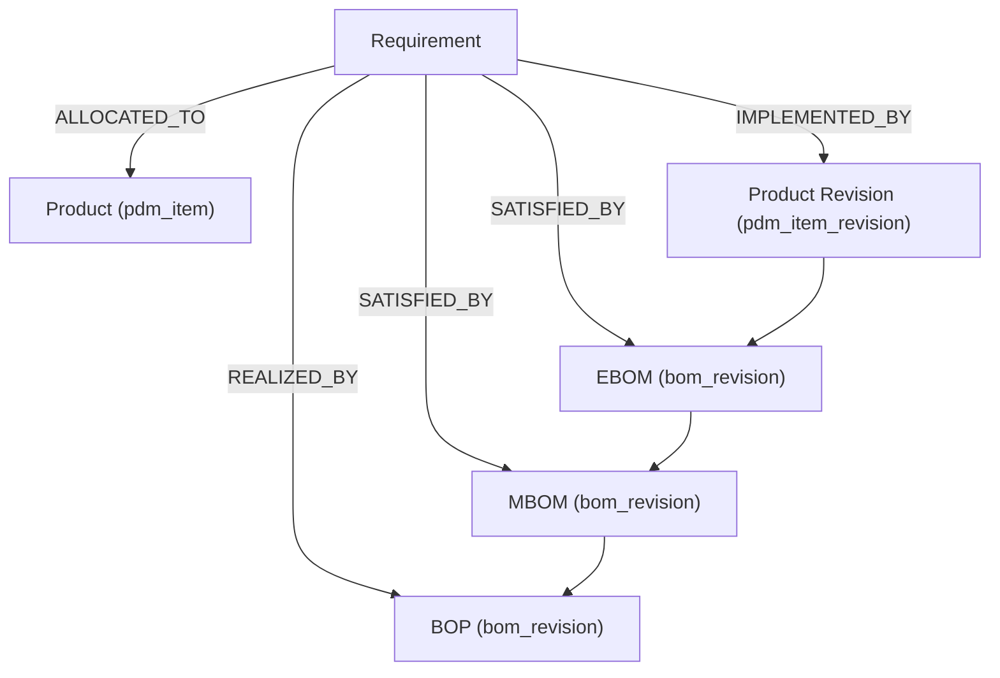
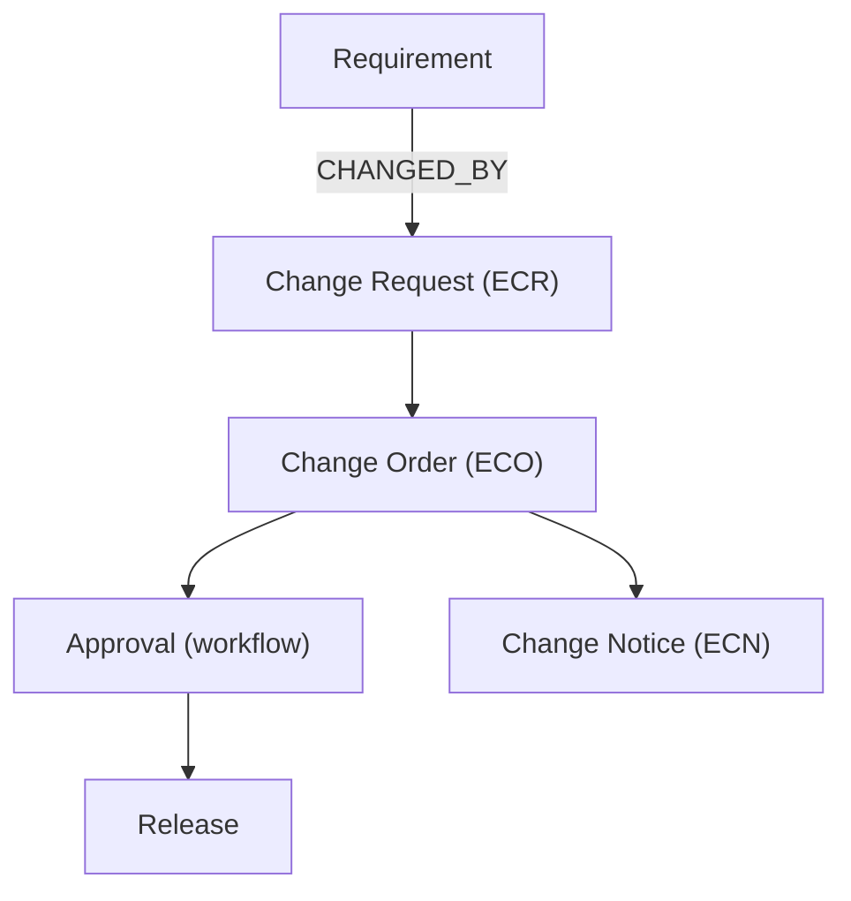
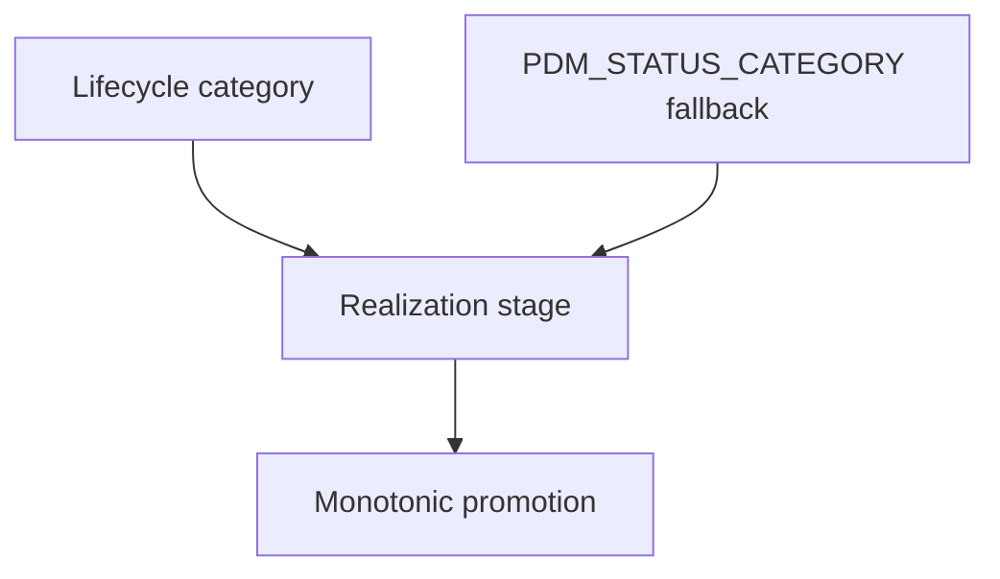
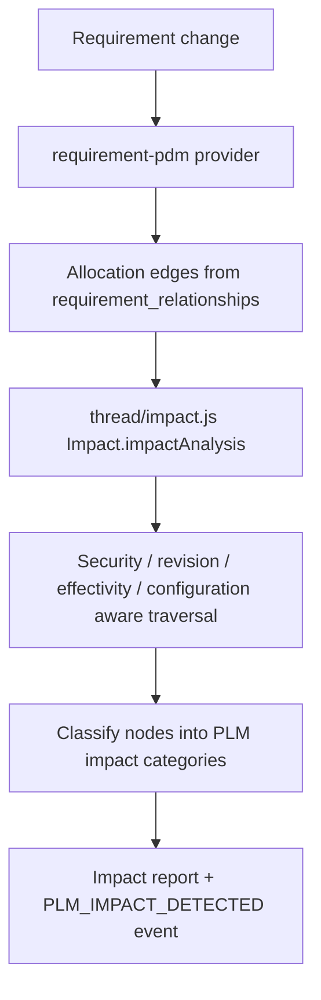

# Requirement → PLM Integration — Design

Integration of the existing **Requirements Manager** into the existing **PLM
digital thread**. Requirements become a native participant in Product, EBOM,
MBOM, BOP, Documents, Change Management, Approvals, Release, Impact Analysis and
Traceability — without introducing a second PLM, a second Change Management
system, or a second engine of any kind.

> Guiding rule: **Search first. Reuse existing objects and services. Extend
> second. Create new infrastructure only when absolutely necessary. The existing
> Change Management capability remains the authoritative system of record for
> formal PLM changes.**

Module root: `server/services/requirement-pdm/`
Frontend workspace: `web/src/pages/RequirementPdmPage.jsx` (route `/requirement-pdm`)

---

## 1. Existing Architecture Analysis

| Capability | Existing owner | How the integration uses it |
| --- | --- | --- |
| Requirements | `services/requirements/` | Source domain; owns requirement state, history and events. |
| Generic relationships | `services/requirements/relationships.js` → `requirement_relationships` | Allocation / change edges are stored here. Never a new relationship table. |
| Product & revisions | `services/pdm/` | `pdm_items`, `pdm_item_revisions`; product identity + lifecycle. |
| Lifecycle | `services/lifecycle/engine.js` | `objectLifecycle` for realized lifecycle state and transitions. |
| EBOM / MBOM / BOP | `services/bom/` | Single `bom_headers`/`bom_revisions`/`bom_lines` model; structure derived from `bom_type`. |
| Change Management | `services/change/` | Authoritative ECR/ECO/ECN system. Integration only creates/links, never re-implements. |
| Workflow / Approval | `services/change/` transitions + `services/workflow/` | Drives request/order/notice lifecycle through existing transitions. |
| Release | `services/change/` + `services/versioning/` | Release effects and baselines produced by the existing release path. |
| Configuration / Variant | `services/bom/variants.js` | `filterByVariant` for configuration-context scoping. |
| Effectivity | `services/bom/effectivity.js` | `filterByEffectivity` for as-of scoping. |
| Documents | `services/content/` (`content`, `content_associations`) | Documents are a projection over content; never copied. |
| Traceability | `services/thread/` (Digital Thread) | Generic impact/traversal engine; requirements joined through a registered provider. |
| Events | `services/events/` + `event_outbox` | Domain events published through the existing outbox; consumers via `event_subscriptions`. |
| API | Express routers + IAM middleware | New router reuses auth/tenant/IAM middleware and error wrapping. |
| Security | `services/iam/` | Reuses IAM resources/actions; no new authz model. |
| Audit | `services/audit/` | `writeAudit` / `recordObjectChange`; requirement history via `requirement_history`. |
| Notifications | `services/notifications/` | `publish[Async]` / `notifyUser|Group|Role`; recipient type `event_payload`. |
| Jobs | `services/jobs/` | Durable, retryable job types for sync/impact/change initiation. |
| Config | `services/config.js` | `requirement_pdm.*` catalog keys. |
| Numbering | `services/numbering.js` | Requirement/change/product numbers. |

---

## 2. Reuse Matrix

For each capability: **REUSE** (used as-is), **EXTEND** (augmented within the
existing owner), **CREATE** (only where nothing suitable existed).

| Capability | Decision | Notes |
| --- | --- | --- |
| Requirements object ownership | REUSE | State stays in Requirements Manager. |
| Requirement identity for the thread | EXTEND | `mirror.js` ensures a generic Object id via the Object framework (`createObject`). No second identity model. |
| Relationship storage | REUSE | `requirement_relationships` (existing). |
| Product / revision | REUSE | `services/pdm`. |
| EBOM / MBOM / BOP | REUSE | One BOM engine; `bom_type` distinguishes structure. No duplicate BOM objects. |
| Lifecycle states | REUSE | Existing lifecycle states; realization stage is a **projection** of lifecycle `category`, never hard-coded. |
| Impact analysis | REUSE | `thread/impact.js` `Impact.impactAnalysis`. No second impact engine. |
| Digital Thread provider | EXTEND | `provider.js` registers a provider that projects `requirement_relationships` into thread edges. |
| Change Request / Order / Notice | REUSE | `services/change` ECR/ECO/ECN. Integration initiates and links; never duplicates. |
| Change rules (auto CR) | CREATE (integration-local) | Config-driven evaluator inside the integration (`change-initiation.js`); produces input to the **existing** Change Management. |
| Workflow / Approval | REUSE | Existing transitions. |
| Release | REUSE | Existing release path + versioning. |
| Configuration / Effectivity filters | REUSE | `bom/variants.js`, `bom/effectivity.js`. |
| Documents | REUSE | `content` + `content_associations`, restricted by `content/constants.js` vocabulary. |
| Traceability queries | EXTEND | Reverse/forward views reuse `requirement_relationships`. |
| Events | REUSE | Existing outbox + subscriptions; new event type codes only. |
| Audit / History | REUSE | `audit/events.js`, `requirement_history`. |
| Notifications | REUSE | Existing notifications service and rules. |
| Jobs | REUSE | Existing job execution framework; new job type codes only. |
| API surface | CREATE | New router that composes reused services. |
| Security resources | CREATE (IAM catalog) | `iam.requirement-pdm[.*]`. |
| Config catalog | CREATE (catalog keys) | `requirement_pdm.*`. |

---

## 3. Object / Relationship Model

Requirement → Product → EBOM → MBOM → BOP:



Requirement → Change Request → Change Order → Approval → Release:



All allocation/link edges are rows in the existing `requirement_relationships`
table (`source_type='requirement'`, `status='ACTIVE'`, `attributes_json` stores
configuration/effectivity/idempotency metadata). Change objects themselves live
in `change_requests`/`change_orders`/`change_notices` and remain authoritative.

Realization stage is derived (projection), never stored as a hard-coded state
list:



---

## 4. Impact Analysis Architecture

The integration does **not** implement impact logic. It registers a Digital
Thread provider and delegates to the existing engine:



- `provider.js#neighbors` joins allocation rows back to requirements via
  `requirements.object_id` (the thread node identity) so traversal is correct
  even when `requirement.id != requirement.object_id`.
- `impact.js` reuses `Impact.impactAnalysis` from `services/thread/`; it only
  classifies the resulting graph using shared PLM vocabulary
  (`CHANGE`, `DOCUMENT`, `PROCESS`, `CONFIGURATION`, `EFFECTIVITY`, `DIRECT`,
  `INDIRECT`).
- Effectivity/configuration awareness comes from the thread engine's own
  `asOf` / `variant` / `configuration` options.
- Large graphs can be dispatched to the existing job framework; an async
  threshold is configurable (`requirement_pdm.impact_analysis_async_threshold`).

---

## 5. Event Specification

Events are published through the existing outbox. Consumers subscribe through
`event_subscriptions` (`consumer_group = 'requirement-pdm'`).

| Event | Producer | Consumer / purpose | Payload (key fields) |
| --- | --- | --- | --- |
| `RequirementPDMTraceCreated` | allocation create | traceability views | allocation_ref, relationship_type, target_type, target_id |
| `RequirementPDMTraceRemoved` | allocation remove | traceability views | allocation_ref, target_type, target_id |
| `RequirementProductAllocated` / `RequirementItemAllocated` / `RequirementRevisionAllocated` / `RequirementDatasetAssociated` | allocation create | downstream projections | allocation_ref, target_type, target_id |
| `RequirementPDMImpactDetected` | impact analysis | UI / rules | impacted_count, released_impacted |
| `RequirementPLMImpactDetected` | PLM impact analysis | UI / rules | impacted_count, released_impacted, categories |
| `RequirementPDMCompatibilityChanged` | compatibility check | UI | allocation_ref, status |
| `RequirementChangeInitiated` | change initiation | audit / rules | requirement, change_type |
| `RequirementChangeRequestCreated` | auto change initiation | notification / rules | change_request_id, rule |
| `RequirementPLMChangeSynchronized` | PLM → Requirement sync | notification / rules | node_type, node_id, requirement_count |
| `RequirementPDMSynchronizationFailed` / `RequirementPLMSynchronizationFailed` | sync failure | retry / alerting | error, requirement_count, failed_count |
| `RequirementPLMReleaseCompleted` | PLM release observed | traceability | node_type, node_id |

Versioning/retry: event type codes are additive (backward compatible);
consumption is idempotent (idempotency key persisted on the relationship
`attributes_json` for change initiation). Failed sync is recorded per
requirement and emits a dedicated failure event so operators can retry safely.

---

## 6. UI Architecture

Workspace `web/src/pages/RequirementPdmPage.jsx` with a shared requirement
selector and a PLM metrics strip. Tabs:

1. **Overview** — module health and coverage summary.
2. **Allocations** — requirement ↔ PLM object allocations.
3. **Coverage & compatibility** — structure coverage and compatibility checks.
4. **Impact & synchronization** — requirement-side impact and sync.
5. **Product & lifecycle** — allocated products and realized lifecycle.
6. **EBOM / MBOM / BOP** — structure projection with configuration / as-of scoping and trace.
7. **Documents** — document projection with category filter (restricted content excluded).
8. **Change requests** — evaluate/initiate change, linked records, CR→ECO→ECN chain.
9. **PLM impact** — impact report and impacted-object table.
10. **Configuration** — `requirement_pdm.*` settings.

---

## 7. API Specification

See `docs/REQUIREMENT_PLM_API.md` for the full endpoint reference (method,
request, response, validation, security, error handling, idempotency).

---

## 8. Test Strategy

| Layer | Location | Coverage |
| --- | --- | --- |
| Unit | `server/tests/requirement-plm-*.test.js` | allocation, product relationship, EBOM/MBOM/BOP traversal, impact, configuration/effectivity filtering, lifecycle validation, change initiation, idempotency. |
| Integration | `requirement-plm-change.test.js`, `requirement-plm-product.test.js`, `requirement-plm-structure.test.js` | Requirement→Product/EBOM/MBOM/BOP, CR→CO→Approval→Release. |
| Event | `requirement-plm-sync.test.js`, `requirement-plm-safety.test.js` | sync events, failure events, provider/subscription registration. |
| Security | `requirement-plm-safety.test.js`, `requirement-plm-documents.test.js` | unauthorized objects hidden, unauthorized change actions rejected, restricted documents excluded. |
| Performance | `requirement-plm-performance.test.js` | large EBOM/MBOM/BOP, large traceability graph, many requirements, high event volume, concurrent change requests, large impact analysis. |
| End-to-end | `requirement-plm-e2e.test.js` | full Requirement→PLM walk (allocate → structures → documents → release → impact → CR → ECO → ECN → sync → audit/metrics). |
| Failure/recovery | `requirement-plm-failure.test.js` | event, API timeout, database, workflow, approval, release, permission, configuration mismatch, effectivity mismatch — each verifies no partial state and recovery. |
| Regression | entire `server/tests/requirement-pdm-*.test.js` + `requirement-plm-*.test.js` | 81 tests across 13 suites. |

Run:

```bash
FILE_STORAGE_PROVIDER=memory PGPASSWORD=helix node --test --test-concurrency=1 server/tests/requirement-pdm-*.test.js server/tests/requirement-plm-*.test.js
```

---

## 9. Architectural Constraints Honored (DO NOT)

- No second Change Management system — `services/change/` remains authoritative.
- No second Impact/Workflow/Approval/Lifecycle/Configuration/Effectivity/Traceability/Event/Audit engine.
- No duplicate EBOM/MBOM/BOP objects — one BOM engine, `bom_type` only.
- No Requirement-specific copies of PLM objects — allocations are edges.
- No hard-coded lifecycle states, configurations or effectivity rules.
- No bypass of Change Management / approval / release.
- No duplicate Change Requests from repeated events — idempotency key persisted.
